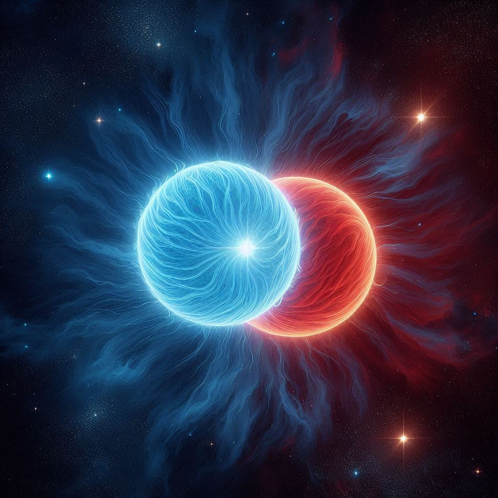

# Neutron and boson stars in the context of General Relativity

This repository is a compilation of the lectures: "Gravitation, Numerical Methods, and Python" given at the Workshop of Cosmology and Gravitation, Zacatecas 2024, organized by the Cosmology and Gravitation group at the [Unidad Académica de Física](https://fisica.uaz.edu.mx) affiliated with the [Autonomous University of Zacatecas](https://www.uaz.edu.mx). The lectures are focused on finding numerical solutions to the GR field equations associated with a static and spherically symmetric spacetime line element, capable of describing compact objects such as neutron and boson stars.

The published materials include a main presentation, as well as some Mathematica and Jupyter notebooks:

- [Mathematica Nothebook](/Mathematica_Notebook/)

- [Jupyter Nothebook](/Jupyter_Notebook/)

In addition, we include a folder with some equations of state ([EoSs](/EoS)) and a package [stars](/stars/) with the TOV and EKG systems of equations. Other tools, and resources used in the lectures are also include.

## Contact
You can contact me via email: arestrada(at)fisica.uaz.edu.mx/arestrada(at)fisica.ugto..mx